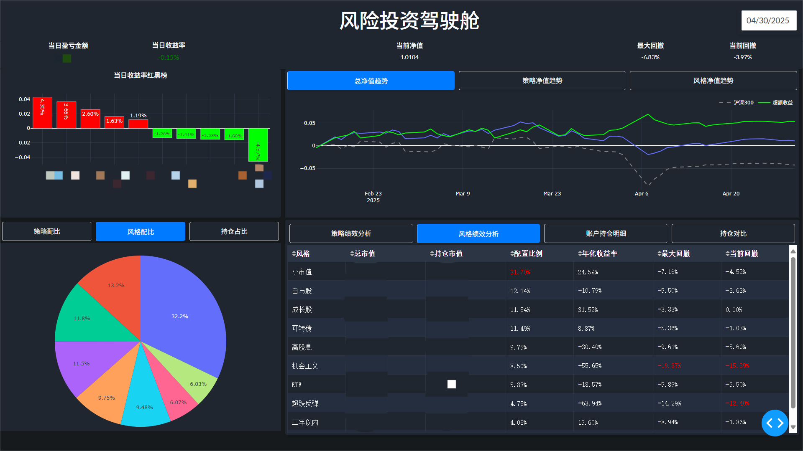

# 投资驾驶舱

## 项目简介
投资驾驶舱是一个基于 Dash 和 Plotly 的量化投资数据可视化工具。它提供了多种图表和表格，用于展示投资组合的市场价值、收益率、净值趋势等信息。

## 主要功能
- 显示当日盈亏金额、当日收益率、当前净值、最大回撤和当前回撤。
- 展示当日收益率红黑榜、组合净值趋势和策略净值趋势。
- 提供策略市值占比和风格市值占比的饼图。
- 显示总净值趋势和策略回撤分析、风格回撤分析的表格。
- 支持通过日期选择器选择不同日期的数据。
- 提供策略盈亏详情和策略净值贡献的弹出框。

## 安装依赖
在运行项目之前，请确保已安装以下依赖：
```bash
pip install dash dash-bootstrap-components pandas plotly
```

## 运行项目
在项目根目录下运行以下命令启动服务器：
```bash
python app.py
```

## 文件结构
- `app.py`: 主应用文件，包含页面布局和所有交互回调。
- `src/data_processor.py`: 数据处理模块，负责读取和处理投资数据。
- `src/chart_factory.py`: 图表工厂模块，负责创建各种图表。
- `src/config.py`: 配置文件，包含颜色、图表布局等配置信息。
- `portfolio_market_value.csv`: 主要投资组合市值数据文件，支持所有核心图表和分析。
- `holdings.tsv`: 账户持仓明细数据。
- `holdings/`: 存放各来源持仓明细（如 etfdl.txt、guoren.txt、xueqiu.txt 等），用于持仓对比和风格分析。

## 使用说明
1. 启动服务器后，打开浏览器访问 `http://127.0.0.1:8050`。
2. 使用页面上的日期选择器选择不同日期，查看相应的数据和图表。
3. 点击当日盈亏金额、当前净值，可查看详细的策略盈亏详情和策略净值贡献。
4. 切换“持仓对比”Tab，可对比账户与实际持仓差异。
5. 点击风格饼图可弹出风格策略详情。

## 数据文件说明
- `portfolio_market_value.csv`：每日投资组合市值、收益等主数据，需定期更新。
- `holdings.tsv`：账户实际持仓明细。
- `holdings/` 目录下各 txt 文件：不同来源的持仓明细（如雪球、果仁、joinquant等），用于风格和持仓对比分析。

## 示例图


## 更新日志
### 2025-04
- 新增“持仓对比”Tab，支持账户与实际持仓差异分析。
- 新增“风格策略详情”弹窗，支持风格分布和明细联动展示。
- 新增“策略持仓详情”弹窗。
- 多个表格和图表支持按日期动态刷新。
- 优化弹窗交互，提升数据钻取能力。
- 细化数据文件结构说明。

## 贡献
欢迎提交问题和贡献代码！请确保在提交 PR 之前运行所有测试并通过。

## 许可证
本项目基于 MIT 许可证开源。